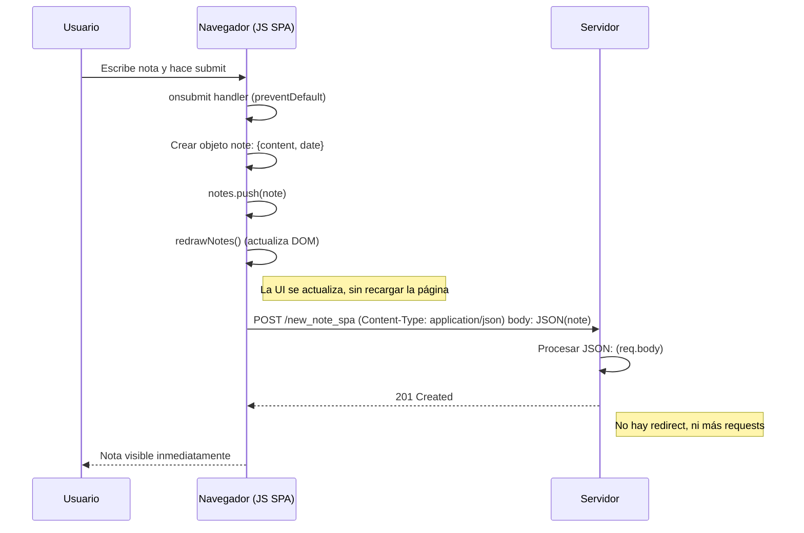

```mermaid
sequenceDiagram
    participant U as Usuario
    participant B as Navegador (JS SPA)
    participant S as Servidor

    U->>B: Escribe nota y hace submit
    B->>B: onsubmit handler (preventDefault)

    B->>B: Crear objeto note: {content, date}
    B->>B: notes.push(note)
    B->>B: redrawNotes() (actualiza DOM)

    Note right of B: La UI se actualiza, sin recargar la página

    B->>S: POST /new_note_spa (Content-Type: application/json) body: JSON(note)

    S->>S: Procesar JSON: (req.body)
    S-->>B: 201 Created

    Note right of S: No hay redirect, ni más requests

    B-->>U: Nota visible inmediatamente
```